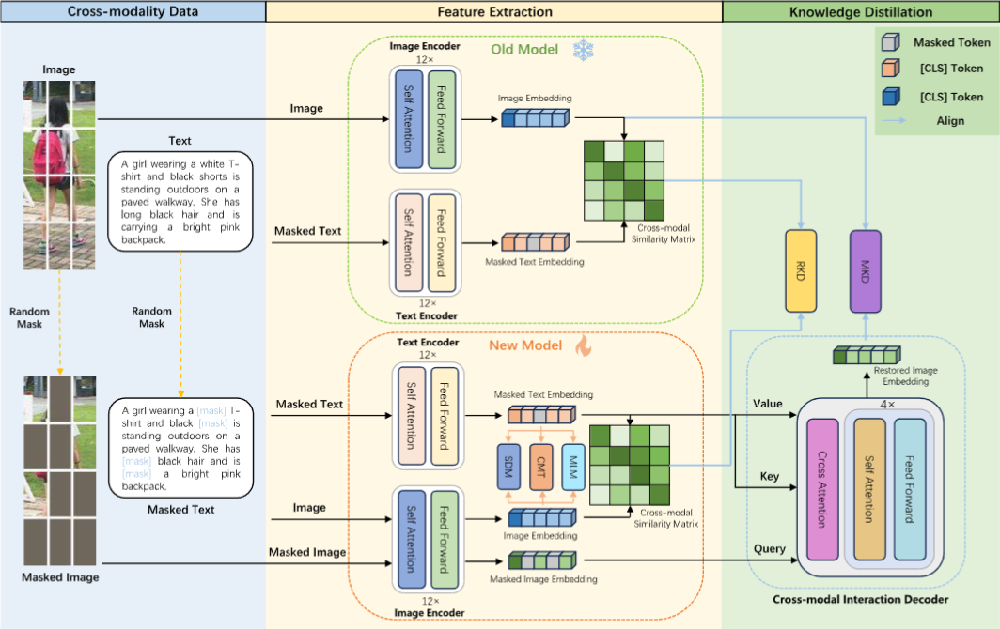
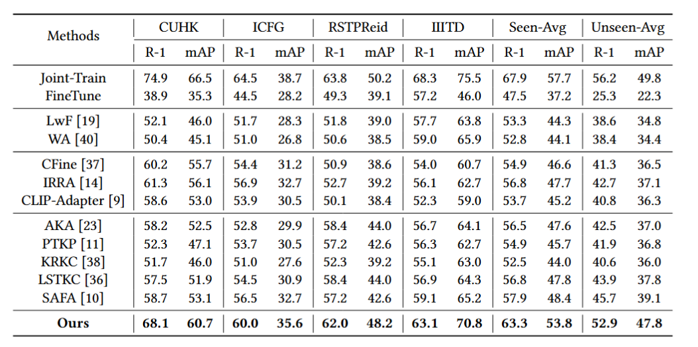

# Dual-level Knowledge Distillation for Lifelong Text-to-Image Person Re-Identification


## Installation
```shell
conda create -n SRKD python=3.7
conda activate SRKD
pip install torch==1.13.1+cu117 torchvision==0.14.1+cu117 torchaudio==0.13.1 --extra-index-url https://download.pytorch.org/whl/cu117
pip install -r requirement.txt
```
## Prepare Datasets
Download the text-to-image person retrieval datasets [CUHK-PEDES](https://github.com/ShuangLI59/Person-Search-with-Natural-Language-Description), [ICFG-PEDES](https://github.com/zifyloo/SSAN), [RSTPReid](https://github.com/NjtechCVLab/RSTPReid-Dataset), [IIITD](https://github.com/Visual-Conception-Group/Dense-Captioning-for-Text-Image-ReID), [UFine3C](https://github.com/Zplusdragon/UFineBench).
```
datasets
├── CUHK-PEDES
│   └──..
├── ICFG-PEDES
│   └──..
├── RSTPReid
│   └──..
├── IIITD
│   └──..
└── UFine3C
    └──..
```


## Quick Start
Training + evaluation:
```shell
`CUDA_VISIBLE_DEVICES=0,1 torchrun --nnodes=1 --nproc_per_node=2 --master_port=29600 continual_train.py --need_MAE --data_dir '/your/path/data'`
```


## Results
The following results were obtained with two 24GB NVIDIA RTX 3090 GPUs:




## Acknowledgement
Our code is based on the PyTorch implementation of [DKP](https://github.com/zhoujiahuan1991/CVPR2024-DKP) and [IRRA](https://github.com/anosorae/IRRA).


